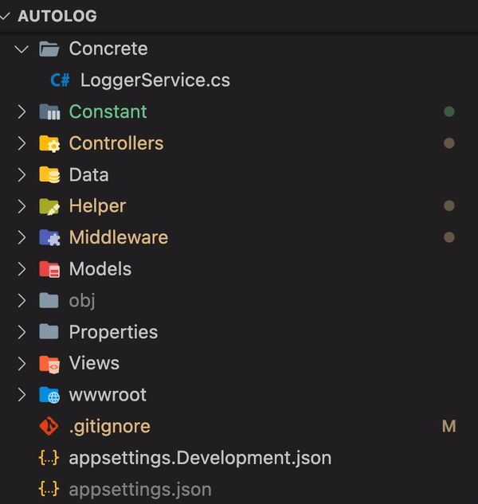
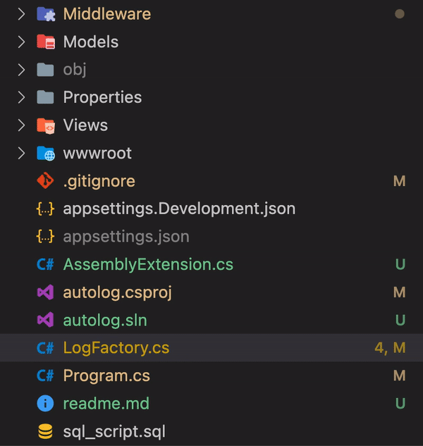

# Dynamic Interface and Class Generation from Database Log Types

This project demonstrates how to read log type data from a database table and dynamically generate corresponding interfaces and classes for each log type. The generated class DLLs can then be included in the project without the need for recompilation, allowing for runtime execution.

Class Generation


<br>
DLL Generation



## Purpose

The main goal of this project is to automate the process of generating interface definitions and class implementations based on the log types stored in a database table. This approach enables seamless integration of new log types without the need for manual code changes and recompilation.

## How to Use

Here's a high-level overview of how to use the project:

1. **Database Configuration**: Configure the database connection details and log type table information in the project's settings.

2. **Reading Log Types**: Implement the logic to read log types from the database table. Each log type should have a unique identifier and associated metadata.

3. **Dynamic Interface and Class Generation**: Use the metadata from the database to dynamically generate C# interfaces and class implementations for each log type. These classes will extend the predefined log interface.

4. **Compile Generated Classes**: Use a code compilation library (such as Roslyn) to compile the dynamically generated classes into separate DLLs.

5. **Runtime Integration**: Include the generated DLLs in your project. During runtime, load the required DLLs dynamically using reflection.

6. **Usage Example**:

   ```csharp
        Assembly dynamicAssembly = Assembly.LoadFrom($"DynamicAssembly-{className}.dll");
        string namespaceName = "autolog.Concrete";
        string fullClassName = namespaceName != null ? $"{namespaceName}.{className}" : className;
     
        Type myClassType = dynamicAssembly.GetType(fullClassName);
     
        ILog instance = (ILog)Activator.CreateInstance(myClassType);